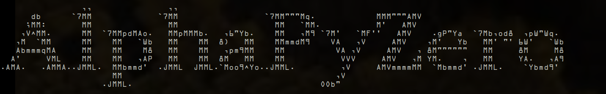

<div id="alphazeropy" align="center">
    <br/>
    
    <h2>Python chess neural network based on AlphaGoZero algorithms.</h2>
</div>


<div id="badges" align="center">
    
[](https://www.python.org/)
    
[](https://github.com/WennMarcoRTX)
[](https://en.wikipedia.org/wiki/Universal_Chess_Interface)

[](https://github.com/WennMarcoRTX/MarcoEngine/actions/workflows/python-app.yml)
    
[](https://svgshare.com/i/Zhy.svg)
[](https://svgshare.com/i/ZhY.svg)
[](https://svgshare.com/i/ZjP.svg)
    
</div>
*AlphaZero* - chess engine, who learn from it's erros. Official AlphaZero is not source, but I create my own AlphaZero. 

# Downloading
To clone directory write in CMD, or another terminal:

```
git clone https://github.com/WennMarcoRTX/ChessAlphaZero.git
```

And, use `CD` to go in repository directory:

```
cd ChessAlphaZero
```
# Config changes

We have config. You can not do changes, but if you need...

### Where is config?

Config starts on [17th](./main.py#17) line in the [main file](./main.py). 

### About values

- **numIters**. Number of iterations of self play and loading weights.
- **numEps**. Number of self-playing games.
- **tempThreshold**. Threshold of engine.
- **updateThreshold**. During arena playoff, new neural net will be accepted if threshold or more of games are won.
- **maxlenOfQueue**. Number of game examples to train the neural networks.
- **numMCTSSims**. Number of games moves for MCTS to simulate.
- **arenaCompare**. Number of games to play during arena play to determine if new net will be accepted.
- **showing_board**. Sets __on__/__off__ showing the board in self-playing.
- **checkpoint**. Checkpoint directory.
- **load_model**. Loads model?
- **load_folder_file**. Directory to load file.
- **numItersForTrainExamplesHistory**. Number of iterations in train examples.
